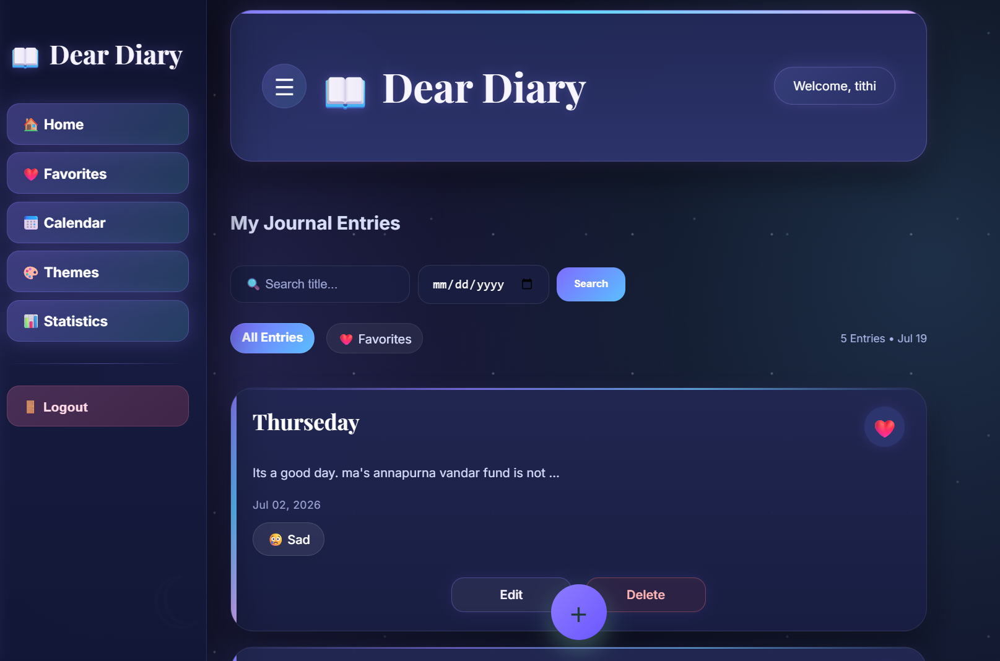
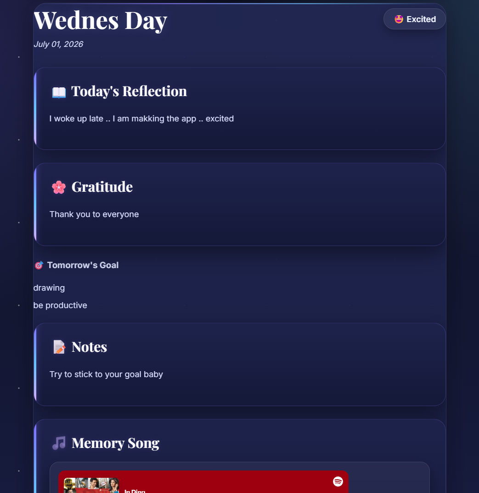

# 📖 Dear Diary

<p align="center">
  <h3 align="center">A Beautiful Digital Journal Built with Django</h3>

  <p align="center">
    Dear Diary is a feature-rich digital journaling application that allows users to capture memories, track moods, organize entries, personalize their experience with beautiful themes, and preserve special moments using music, weather, photos, and PDF exports.
  </p>
</p>

---

# 📸 Application Preview

<p align="center">
  
  
</p>

<p align="center">
  
  
</p>

---

# ✨ Features

### 🔐 Authentication
- User Registration
- Secure Login
- Personalized journal for every user

### 📝 Journal Management
- Create journal entries
- Edit existing entries
- Delete entries
- View detailed journal pages

### 😊 Mood Tracking
- Record your mood with every journal
- Reflect on your emotional journey

### ❤️ Favorite Memories
- Mark important journal entries as favorites
- Quickly revisit special memories

### 📅 Interactive Calendar
- Browse journal entries by date
- Easily navigate your memories

### 🎵 Memory Songs
- Attach Spotify songs to journal entries

### 🌤 Weather Integration
- Save weather information with every journal
- Powered by OpenWeather API

### 📷 Memory Photos
- Upload images to preserve memorable moments

### 📊 Statistics Dashboard
- Track journaling activity
- Visualize your writing habits

### 🎨 Multiple Themes

Personalize your diary with five handcrafted themes:

- 🌸 Blossom
- 🌙 Moonlit Galaxy
- 🌿 Forest Whisper
- 🍂 Autumn Library
- 🌊 Ocean Breeze

### 📄 PDF Export
- Export journal entries as beautifully formatted PDF files

---

# 🛠 Tech Stack

| Category | Technologies |
|-----------|--------------|
| Backend | Python, Django |
| Frontend | HTML5, CSS3, JavaScript |
| Database | PostgreSQL |
| APIs | OpenWeather API, Spotify Embed API |
| PDF Generation | xhtml2pdf |

---

# 📂 Project Structure

```text
Dear_Diary/
│
├── Dear_Diary/
├── journal/
├── screenshots/
├── media/
├── manage.py
├── README.md
└── requirements.txt
```

---

# 🚀 Installation

### Clone the repository

```bash
git clone https://github.com/saha-tithi/Dear_Diary.git
```

### Navigate into the project

```bash
cd Dear_Diary
```

### Create a virtual environment

```bash
python -m venv venv
```

### Activate the virtual environment

**Windows**

```bash
venv\Scripts\activate
```

### Install dependencies

```bash
pip install -r requirements.txt
```

### Apply migrations

```bash
python manage.py migrate
```

### Run the development server

```bash
python manage.py runserver
```

Open your browser and visit:

```
http://127.0.0.1:8000/
```

---

# 🚀 Future Enhancements

- 🤖 AI-powered Mood Analysis
- 🔍 Smart Journal Search
- 🎤 Voice Notes
- ☁️ Cloud Backup
- 📱 Progressive Web App (PWA)
- 🔔 Daily Journal Reminders
- ✨ Rich Text Editor

---

# 👩‍💻 Author

**Tithi Saha**

- 💻 GitHub: https://github.com/saha-tithi
- 💼 LinkedIn: https://www.linkedin.com/in/tithi-saha

---

## ⭐ Show Your Support

If you enjoyed this project or found it useful, consider giving it a ⭐ on GitHub.

It motivates me to keep building and sharing more open-source projects.